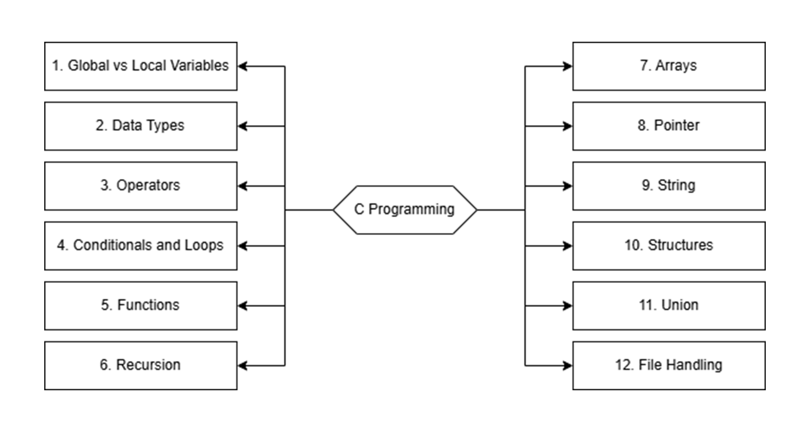
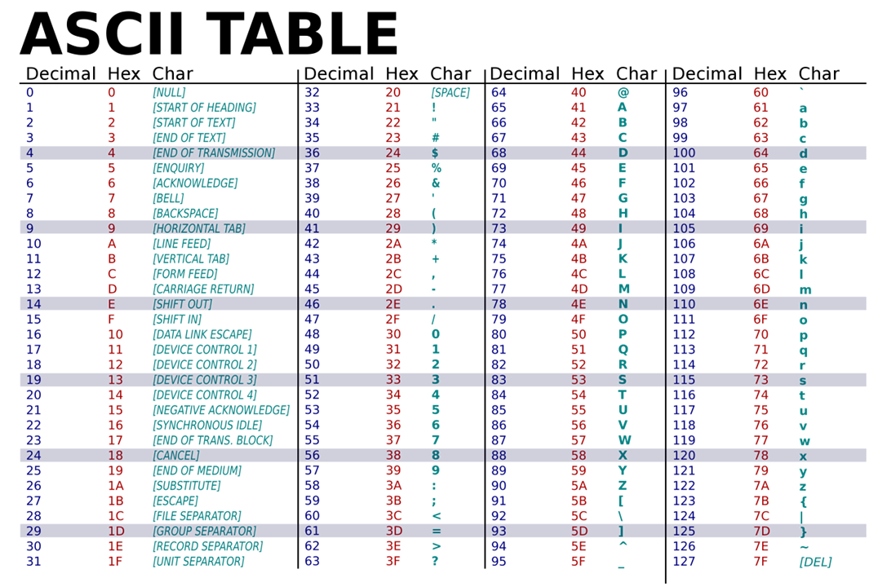

# C Programming & Data Structures

Video Lecture [Playlist](https://youtube.com/playlist?list=PLBlnK6fEyqRhX6r2uhhlubuF5QextdCSM&si=kR9xMoRxZXHNmGL-) from Neso Academy.

Programming & Data Structures includes the concepts of C programming and data structures required for the various computer science examinations. 
This course has been created keeping in mind the previous year question papers of GATE and the current trends followed in GATE. 
These lectures are also useful for college going students and students who are preparing for campus interviews. 

Following is the syllabus.

## C Programming:

1) Introduction to the course.
2) Variables 
3) Global vs Local variables. 
4) Data types  
5) Operators in C  
6) Conditionals and loops 
7) Functions 
8) Recursion  
9) Pointers and arrays 
10) Strings
11) Structure and union 
12) File Handling

## Data Structures:
1) Stacks  
2) Queues  
3) Linked list 
4) Trees  
5) Binary search trees  
6) Binary Heaps  
7) Graphs  
8) Tree Traversals  

## ASCII Table
## 
