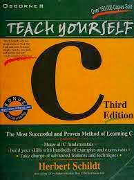

# Data Science from Scratch

This book is unique in its application of mastery learning to teach the C language. Each concept is introduced individually, followed by numerous examples and exercises to ensure thorough understanding. This method guarantees mastery of each topic before progressing to the next.

The material is presented sequentially, necessitating careful study of each chapter. Each chapter builds on the knowledge presented in the preceding ones, so a comprehensive understanding of earlier material is essential.

The book teaches ANSI standard C, ensuring that your knowledge is applicable across a wide range of C environments. It employs contemporary syntax and structure, ensuring that you learn to write C programs correctly from the outset.

## The repository's chapter list:

01. C Fundamentals
02. Introducing C's Program Control Statements
03. More C Program Control Statements
04. A Closer Loop at Data Types, Variables, and Expressions
05. Exploring Arrays and Strings 
06. Using Pointer
07. A Closer Look at Functions
08. Console I/O
09. File I/O
10. Structures and Unions
11. Advanced Data Types and Operators
12. The C Preporcessor and Some Advenced Topics

Throughout this journey, I will provide detailed explanations and insights after completing each chapter, making it an adventurous and thrilling experience for anyone interested in the world of C Programming. Join me as we explore the fascinating realms of Programming learning together!

